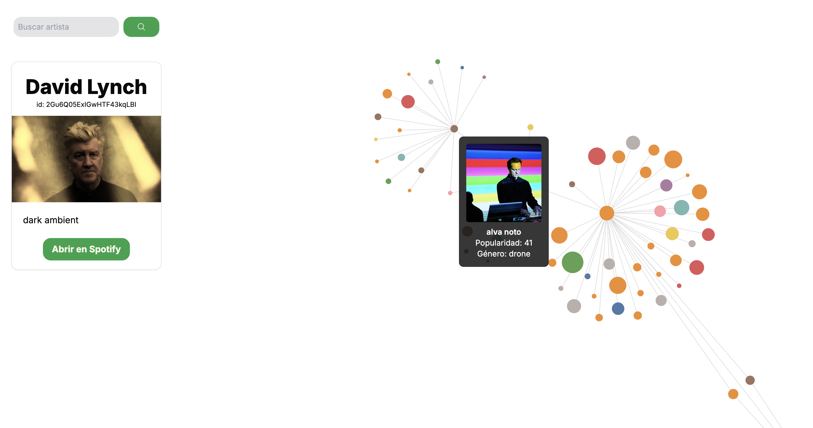

# Red de Colaboraciones Musicales

https://music-colabs.vercel.app/

Una herramienta de exploración interactiva para visualizar la red de colaboraciones entre artistas musicales, utilizando la API de Spotify y D3.js. Comienza con los colaboradores directos de un artista y expande la red nodo por nodo con cada clic, descubriendo conexiones musicales de una forma orgánica.
    


## ⚡️ Características

-   [x] **Búsqueda de Artistas:** Encuentra cualquier artista disponible en la base de datos de Spotify.
-   [x] **Expansión Interactiva del Grafo:** Empieza con los colaboradores directos y expande la red al hacer clic en cualquier artista, creando una visualización única en cada exploración.
-   [x] **Renderizado de Alto Rendimiento:** Utiliza **HTML Canvas** para renderizar grafos con cientos de nodos de forma fluida y sin caídas de rendimiento.
-   [x] **Grafo Interactivo:** Arrastra los nodos para explorar la red a tu gusto.
-   [x] **Tooltips Informativos:** Pasa el ratón sobre cualquier artista para ver su foto, nombre y nivel de popularidad.
-   [x] **Diseño:** Interfaz constuida con Next.js y Tailwind CSS.

## 🛠️ Tecnologías Utilizadas

-   **Framework:** [Next.js](https://nextjs.org/) (React)
-   **Lenguaje:** [TypeScript](https://www.typescriptlang.org/)
-   **Visualización de Datos:** [D3.js](https://d3js.org/) (`d3-force`, `d3-scale`)
-   **Estilos:** [Tailwind CSS](https://tailwindcss.com/)
-   **API:** [Spotify Web API](https://developer.spotify.com/documentation/web-api)
-   **Deployment:** [Vercel](https://vercel.com/)

## 🚀 Cómo Ejecutarlo en Local

Para clonar y ejecutar este proyecto en tu máquina, sigue estos pasos:

1.  **Clona el repositorio:**
    ```bash
    git clone https://github.com/manugarciat/music-colabs.git
    cd music-colabs
    ```

2.  **Instala las dependencias:**
    Se recomienda usar `pnpm`.
    ```bash
    pnpm install
    ```

3.  **Configura las variables de entorno:**
    Necesitas obtener tus propias credenciales de la API de Spotify desde el [Spotify Developer](https://developer.spotify.com/).
    Crea un archivo llamado `.env.local` en la raíz del proyecto y añade tus credenciales:
    ```
    SPOTIFY_CLIENT_ID=tu_client_id_de_spotify
    SPOTIFY_CLIENT_SECRET=tu_client_secret_de_spotify
    ```

4.  **Inicia el servidor de desarrollo:**
    ```bash
    pnpm dev
    ```

5.  Abre [http://localhost:3000](http://localhost:3000) en tu navegador para ver la aplicación.

## 📄 Licencia

Este proyecto está bajo la Licencia MIT.
