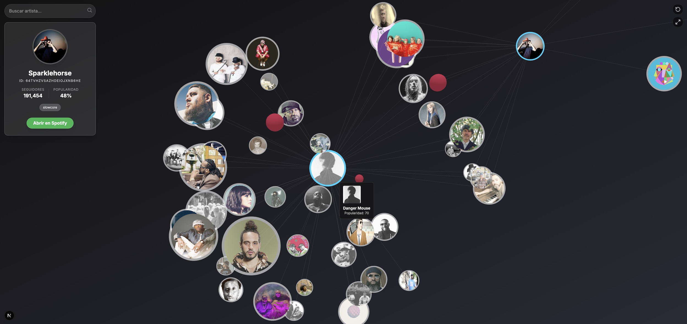

# Red de Colaboraciones Musicales

https://music-colabs.vercel.app/

Una herramienta de exploración interactiva para visualizar la red de colaboraciones entre artistas musicales, utilizando la **API de Spotify** y **Three.js**. Comienza con los colaboradores directos de un artista y expande la red nodo por nodo en un entorno 3D, descubriendo conexiones de forma orgánica.
    


## ⚡️ Características

-   [x] **Búsqueda:** Buscador predictivo con sugerencias en tiempo real y navegación directa por ID.
-   [x] **Visualización 3D Inmersiva:** Explora la red en un espacio tridimensional ("Galaxy View") renderizado con **Three.js** y **WebGL**.
-   [x] **Expansión Interactiva:** Haz clic en cualquier nodo para revelar sus colaboradores y expandir el universo musical dinámicamente.
-   [x] **Metadatos Enriquecidos:** Panel lateral con seguidores, popularidad, géneros y enlaces directos a Spotify.
-   [x] **Controles de Cámara:** Navegación orbital completa, con botones para pantalla completa y reseteo de vista.

## 🛠️ Tecnologías Utilizadas

-   **Framework:** [Next.js 15](https://nextjs.org/) (React 19)
-   **Lenguaje:** [TypeScript](https://www.typescriptlang.org/)
-   **Visualización 3D:** [react-force-graph-3d](https://github.com/vasturiano/react-force-graph) (Three.js engine)
-   **Estilos:** [Tailwind CSS](https://tailwindcss.com/)
-   **Iconos:** [Lucide React](https://lucide.dev/)
-   **API:** [Spotify Web API](https://developer.spotify.com/documentation/web-api)
-   **Deployment:** [Vercel](https://vercel.com/)

## 🚀 Cómo Ejecutarlo en Local

Para clonar y ejecutar este proyecto en tu máquina, sigue estos pasos:

1.  **Clona el repositorio:**
    ```bash
    git clone https://github.com/manugarciat/music-colabs.git
    cd music-colabs
    ```

2.  **Instala las dependencias:**
    Se recomienda usar `pnpm`.
    ```bash
    pnpm install
    ```

3.  **Configura las variables de entorno:**
    Necesitas obtener tus propias credenciales de la API de Spotify desde el [Spotify Developer](https://developer.spotify.com/).
    Crea un archivo llamado `.env.local` en la raíz del proyecto y añade tus credenciales:
    ```
    SPOTIFY_CLIENT_ID=tu_client_id_de_spotify
    SPOTIFY_CLIENT_SECRET=tu_client_secret_de_spotify
    ```

4.  **Inicia el servidor de desarrollo:**
    ```bash
    pnpm dev
    ```

5.  Abre [http://localhost:3000](http://localhost:3000) en tu navegador para ver la aplicación.

## 📄 Licencia

Este proyecto está bajo la Licencia MIT.
